# KEYESTUDIO Raspberry Pi 5 PCIE-M.2 NVME SSD Shield

## Overview

KEYESTUDIO Raspberry Pi 5 PCIE-M.2 NVME SSD Shield is an NVME M2 SSD PIP (PCIe Peripheral Board) for Raspberry Pi 5, which uses the new PCIE interface of Raspberry Pi 5 to connect NVME M2 SSD for fast data transfer and ultra-fast start up.

KEYESTUDIO Raspberry Pi 5 PCIE-M.2 NVME SSD Shield Supports：2230 / 2242 / 2260 / 2280 NVMe M2 SSD

Incompatible NVMe  SSD：WD Blue SN550/SN580 series，WD Green SN350 series，WD Black SN850 series，WD Black SN770，Inland tn446 nvme drive，Corsair MP600 SSD，Other NVMe SSD drivers equipped with the same **Phison controller**.

For more details about SN550, refer to it： [New rpi-eeprom-update 2024-01-24 WD Blue SN550 nvme works now.](https://forums.raspberrypi.com/viewtopic.php?t=364327)

<p style="color:red;">KEYESTUDIO Raspberry Pi 5 PCIE-M.2 NVME SSD Shield is only compatible with M.2 NVMe SSD. It is not compatible with M.2 SATA SSD, M.2 PCIe AHCI SSD or other M.2 non-NVMe devices.</p>

## List：

| 序号 | 名称                                               | 图片 | 数量 |
| ---- | -------------------------------------------------- | ---- | ---- |
| 1    | KEYESTUDIO Raspberry Pi 5 PCIE-M.2 NVME SSD Shield |      | 1    |
| 2    | M2.5*17mm 双通铜柱                                 |      | 3    |
| 3    | M2.5*5mm 圆头十字螺钉                              |      | 6    |
| 4    | 16Pin FPC                                          |      | 1    |
| 5    |                                                    |      |      |
| 6    |                                                    |      |      |
| 7    |                                                    |      |      |
| 8    |                                                    |      |      |


## Assembly：


### Assemble on top of Raspberry Pi：


### Assemble under the Raspberry Pi：


## Raspberry Pi Basic Tutorial：

<p style="color:red;">Refer to the link</p>

[Raspberry Pi basic tutorial](RaspberryPiBasicTutorial.md)

## Using Method：

The Raspberry Pi 5 has an FPC connector on the side of the board，which provides a PCIe Gen 2.0 ×1 interface. This tutorial introduces and demonstrates how to use this PCIe interface to connect an M.2 solid-state drive (SSD). The SSD can be used as a boot disk or additional storage.


### 1.As a storage disk for Raspberry Pi 5：

Steps to use SSD firmware as a storage disk:

 A. Modify config.txt in the tf card boot partition and enable the PCIe interface

 B. Connect the solid state drive

 C. Partition the SSD

 D. The solid-state drive can be recognized after power-on and startup

1.1 Use Raspberry Pi Imager software to burn the Raspberry Pi 5 image system to the SD card

1.2 After the system burning is completed, insert the SD card and you can see the boot disk in the TF card and enter the boot disk.

1.3 Find and open config.txt, and add the following code at the end of the file.

```bash
dtparam=pciex1
```

If you are willing to use PCIe 3.0 then enter:

Note: With corresponding settings, this interface can work in PCIe Gen 3.0 ×1 mode. Raspberry Pi 5 has not been certified for Gen 3.0 speed. Connecting to PCIe devices at Gen3 speed may be unstable. 

```bash
dtparam=pciex1
dtparam=pciex1_gen=3
```

Save content after modification.


1.4 Install the Raspberry pi 5 SSD Shield and SSD firmware on the Raspberry Pi 5, then insert the SD card with the burned system in, and power on. After booting successfully, find the IP address of the Raspberry Pi, and then use the "vncviewer" software to enter the remote desktop.（For more details, refer to it :[RaspberryPiBasicTutorial](RaspberryPiBasicTutorial.md)）

1.5 After entering the remote desktop, if you are using an SSD solid state drive without partitions, then you cannot see the SSD solid state drive in your file bar, then we need to partition the hard drive.

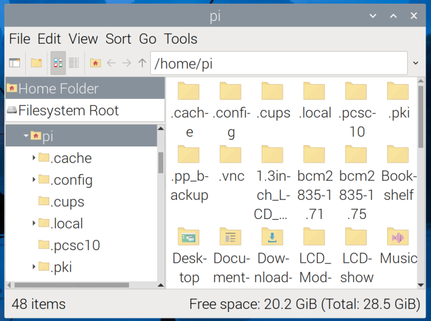

1.6 Tap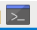 and input.

```bash
sudo fdisk -l
```

After completing the input, press the Enter key.

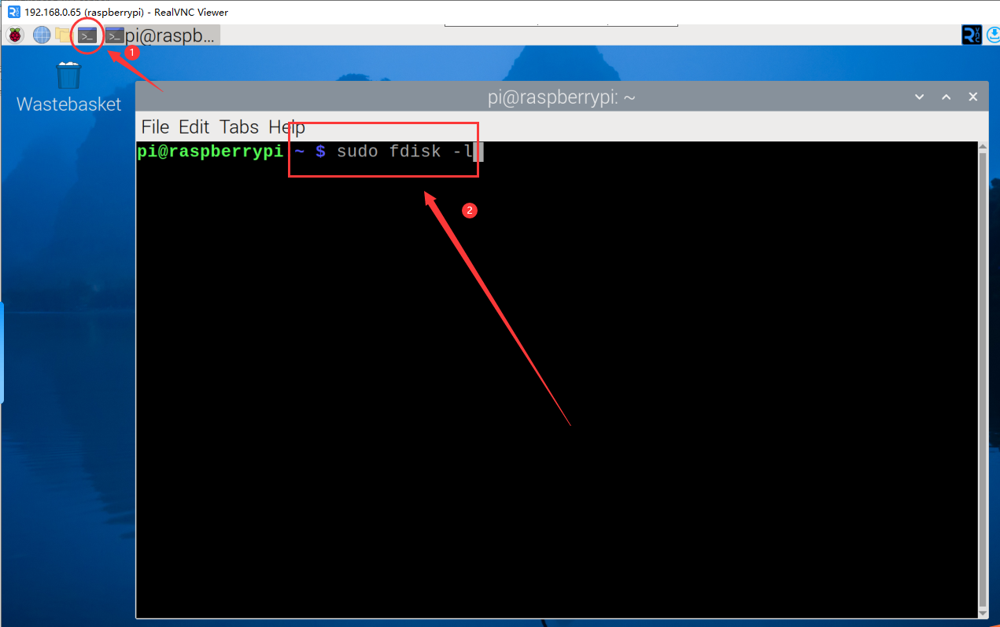

1.7 Find it according to the capacity of your hard drive and remember its name. For example, mine is a 128G hard drive, and its name is "nvme0n1". The Sector size needs to be remembered, which is 512 bytes in our place (it will be used when partitioning the hard disk).

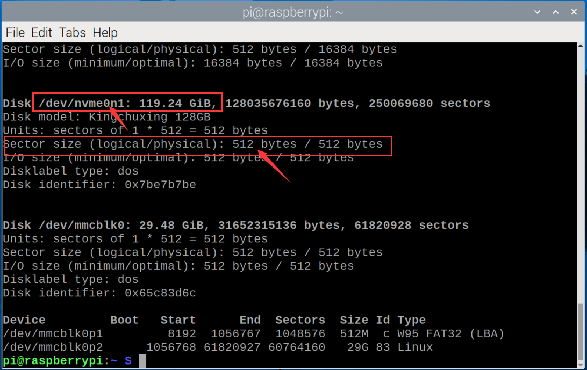

1.8 Now we perform partitioning operations and enter.

```bash
sudo fdisk /dev/nvme0n1
```

After completing the input, press the Enter key.

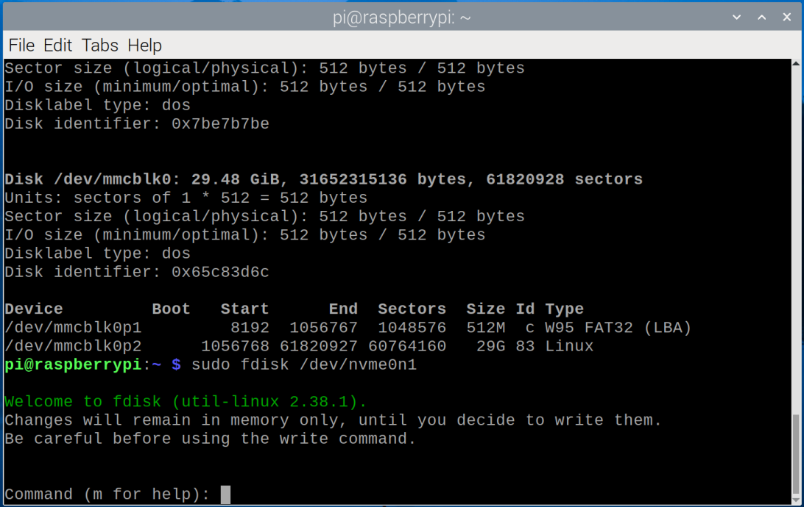

1.9 Type `n` after the Command (m for help): and press Enter.

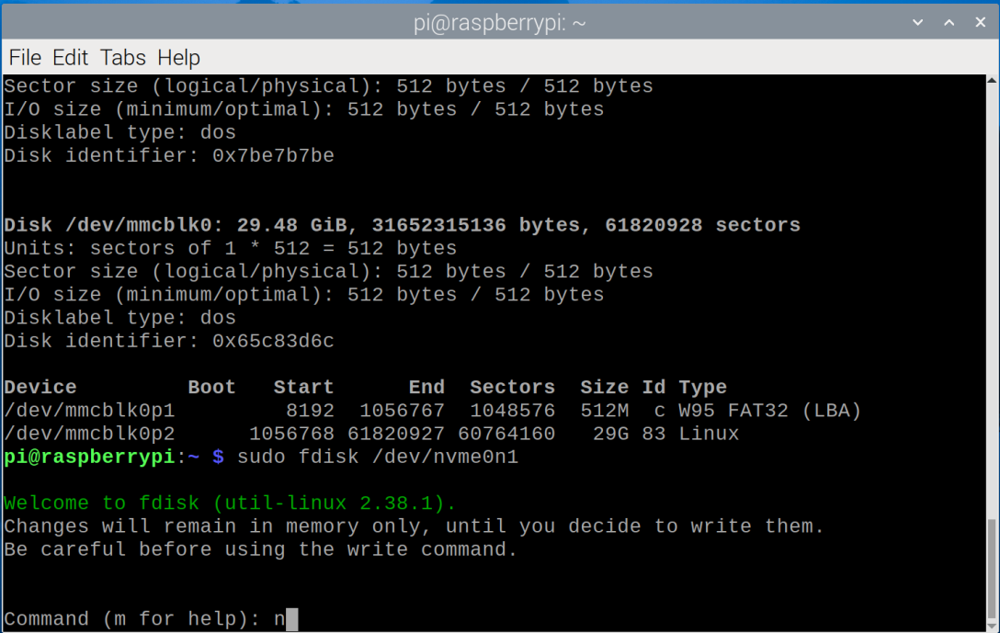

1.10 When you see Select (default p): , just use the default settings and press Enter.

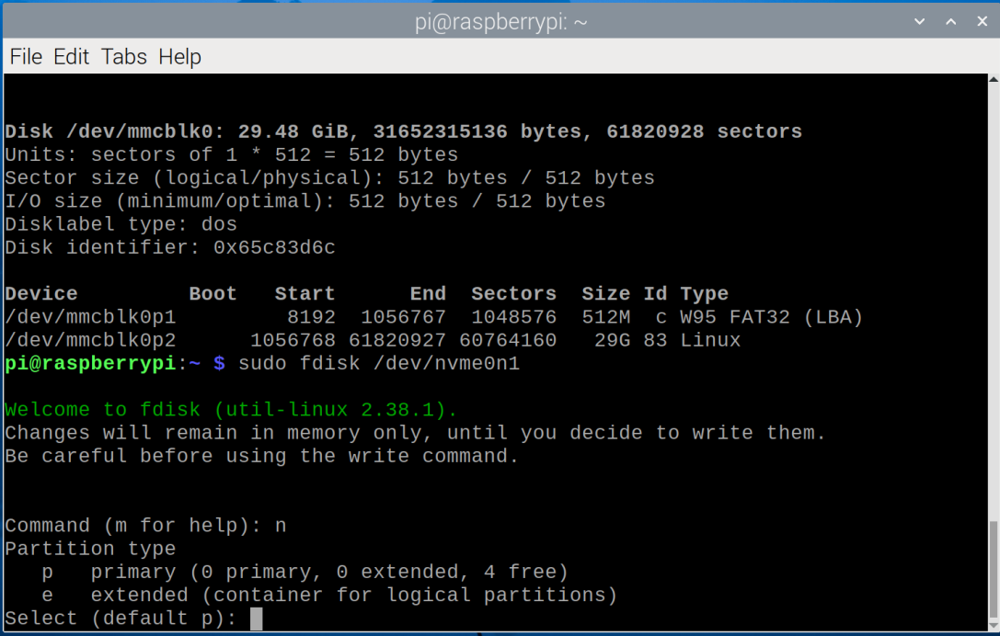

1.11 Press the Enter key.

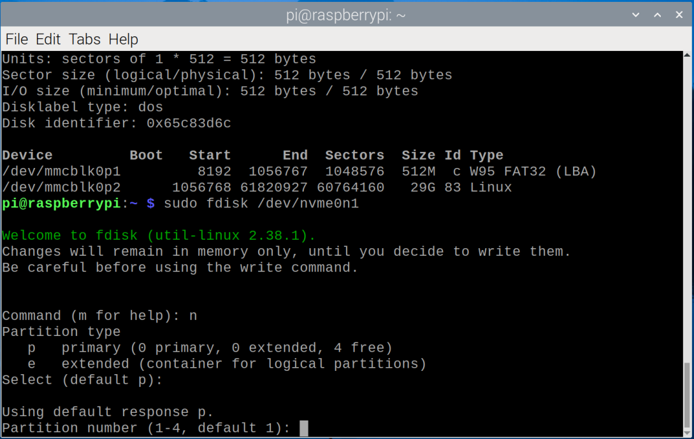

1.12 Press the Enter key.

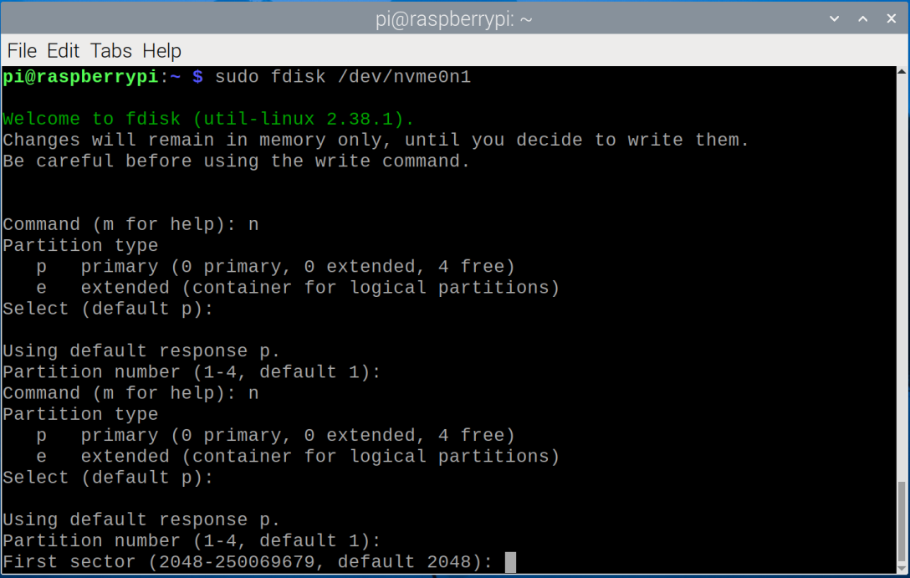

 1.13 This step involves calculation of capacity allocation. If you want to partition, please read it carefully. In the example we are using a 128G hard disk, and it will be divided into three 42G areas.

<p style="color:red;">Note: If you do not need partitioning, just press Enter to keep the default settings, so that 128G will be divided into one area.</p>

Calculate how many sector bytes are needed for each area. From the command line prompt, we can know that our hard disk bytes start from 2048 and end at 250069679.

Then we first need to subtract the previous 2048 to get the total number of bytes of 128G:
$$
250069679-2048=250067631
$$
Because we want to divide 128G into 3 parts, we need to divide the total number of bytes by 3.
$$
250067631÷3=83355877
$$
83355877 is the cutoff byte of the first area, enter `83355877` and press Enter.

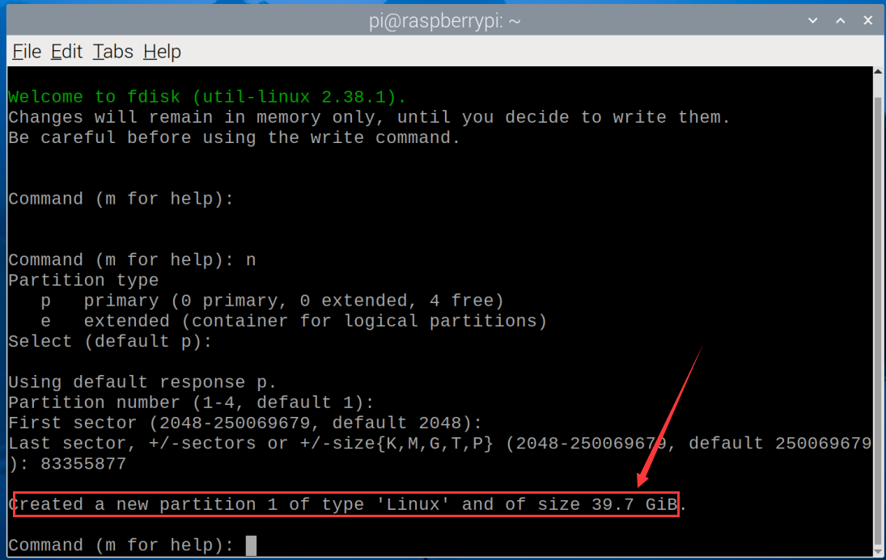

Enter the command `n` , and press the Enter key until the byte partition appears.

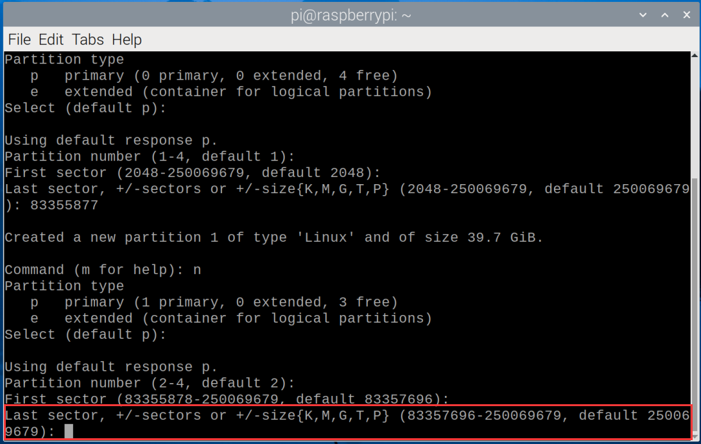

Multiply 83355877 by 2 to get the byte at the end of the second area.
$$
83355877×2=166711754
$$
Enter `166711754` and press Enter.

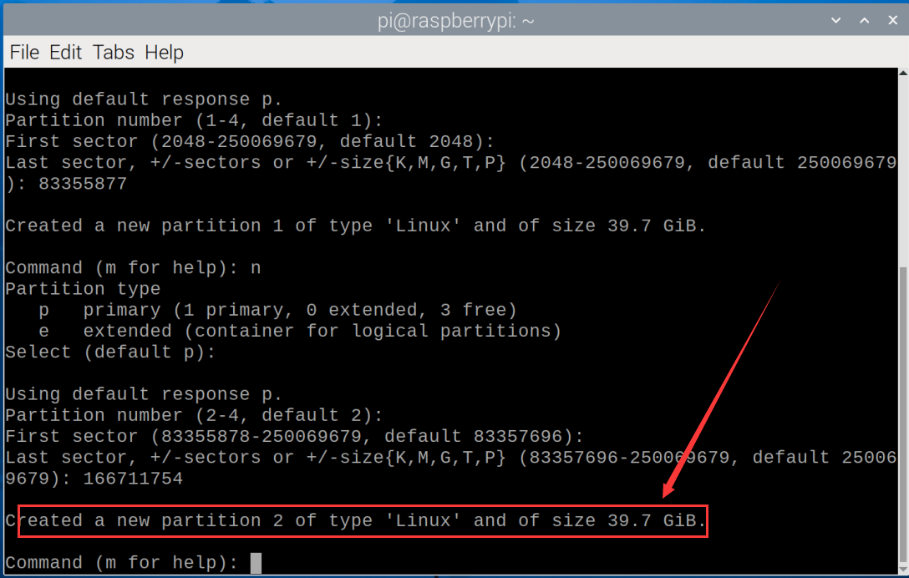

Then enter the `n` command, because this is the last area, just press Enter key.

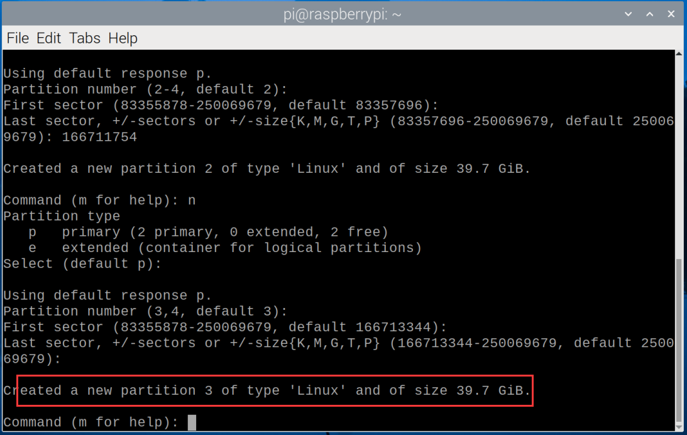

 1.13 Enter the `w` command to save it (be sure to report an error otherwise you will have to repartition).

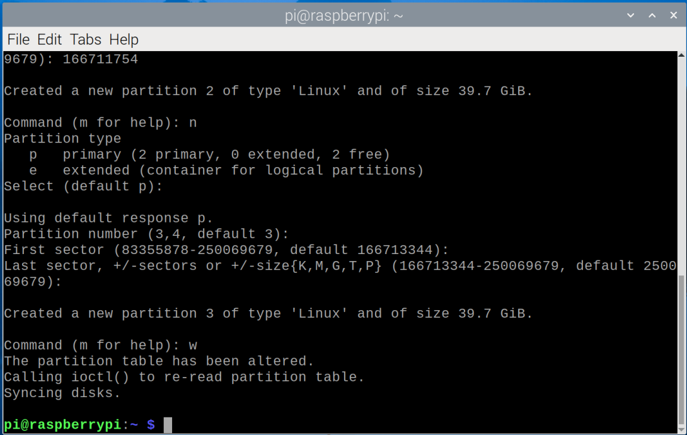

1.14 After the partition is completed, enter the `sudo fdisk -l` command to view the partition name.

```bash
sudo fdisk -l
```

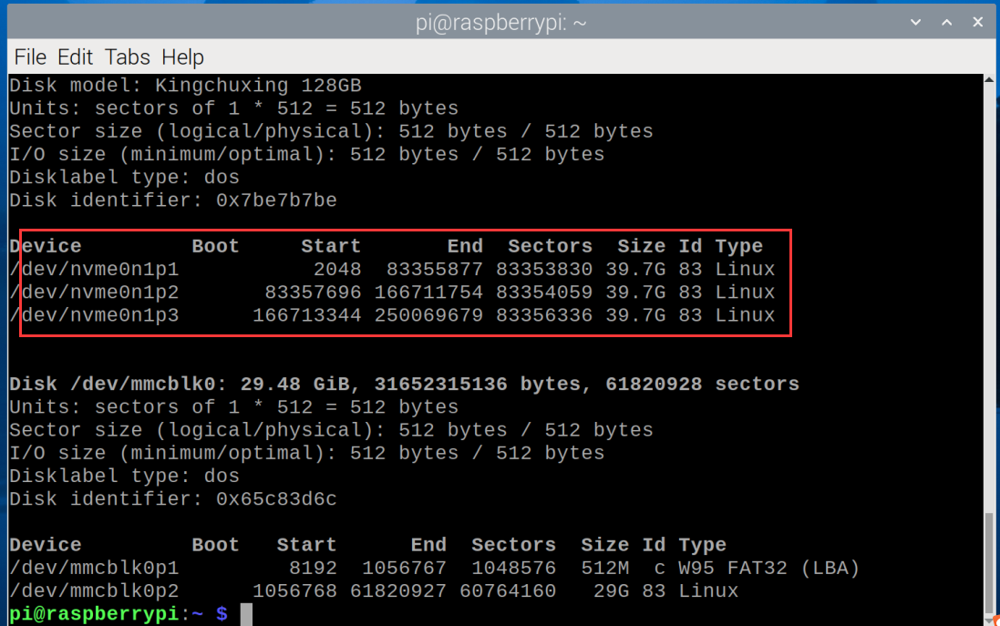

1.14 Partition formatting and mounting. Each partition needs to be formatted so that it can be mounted and used. You can use the `mkfs` command to format a partition, such as `sudo mkfs.ext4 /dev/sdXY` (replace XY with the partition number you want to format, such as /dev/sdX1). The ext4 file system is used here, but you can also choose other file systems, such as FAT32, NTFS, etc.

We format the partition as FTA32 and format the first partition `nvme0n1p1`.

```bash
sudo mkfs.vfat -F 32 /dev/nvme0n1p1
```

Format the second partition `nvme0n1p2`, we will format it as ext4.

```bash
sudo mkfs.ext4 /dev/nvme0n1p2
```

Format the third partition `nvme0n1p3`, we will format it as NTFS.

```bash
sudo mkfs.ntfs /dev/nvme0n1p3
```

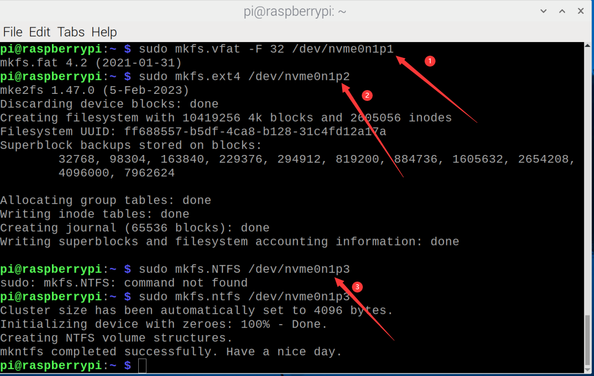

1.15 Open the folder and you will see the partitioned disks.

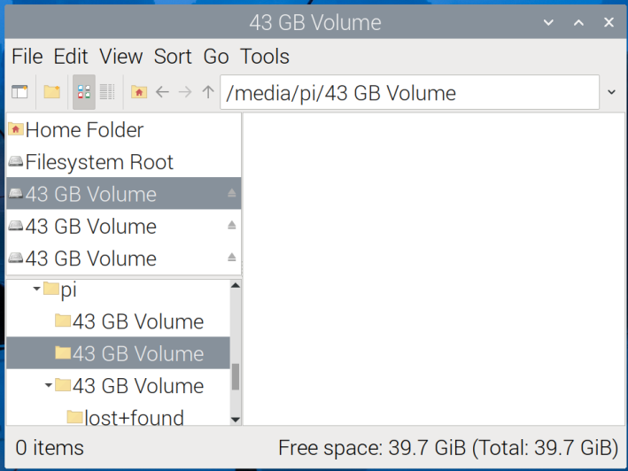

### 2.As a boot disk for Raspberry Pi 5：

Idea:

A. Start using the TF card image first (note: modify the config.txt of the TF card first)

B. Copy the system to the SSD

C. Modify the EEPROM and enable PCIe boot mode

D. Remove the SD card and power on the Raspberry Pi

#### 2.1 Use SD card to copy image system to SSD solid state drive

2.1.1  First burn the image system to the SD card, then plug and unplug the SD card reader and find 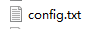 in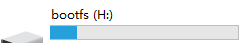file, and double-click to open it, then add the following code at the end of the file:

```bash
dtparam=pciex1
```

If you are willing to use PCIe 3.0 then enter:

<p style="color:red;">NOTE: Raspberry Pi 5 is not certified for Gen 3.0 speeds and connections to PCIe devices may be unstable at these speeds.</p>

```bash
dtparam=pciex1
dtparam=pciex1_gen=3
```

Save content after modification.


Create a text file named SSH in bootfs and delete the following .txt.

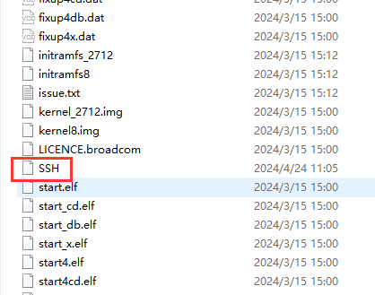

After configuration, use puTTY software to connect and open VNC, then use VNC software to enter the remote desktop, click 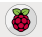on the upper right corner(for entering the desktop, refer to the Raspberry Pi Basic Tutorial).

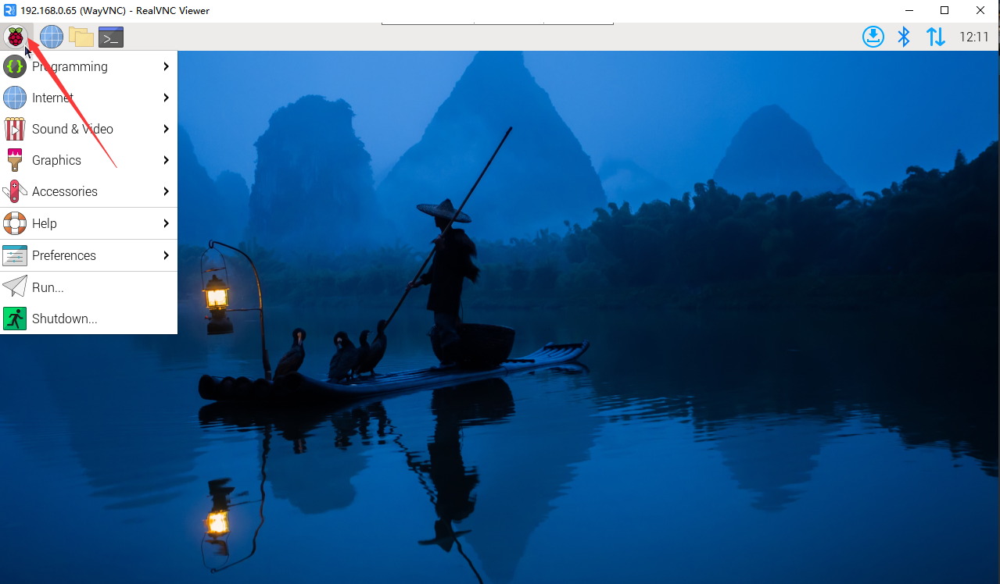

2.1.2 Tap and 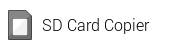.

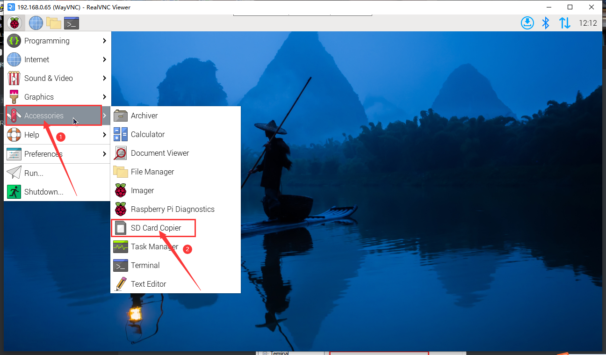

2.1.3 Click the box behind "Copy From Device" and select SD.

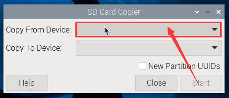

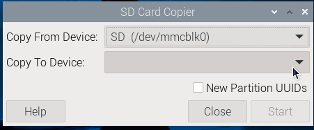

2.1.4 Click the box behind "copy To Device" and select our SSD.

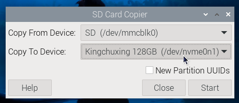

2.1.5 Click “Start” and “YES”.

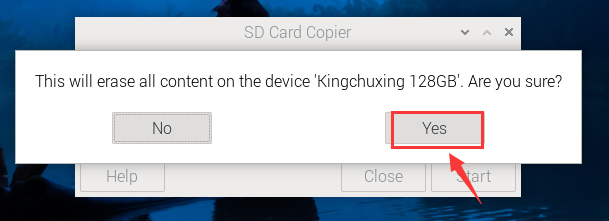

Wait for copy to complete.

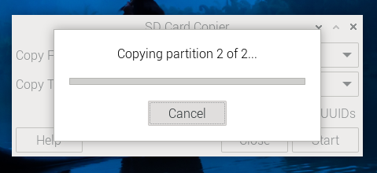

Tap “OK”.

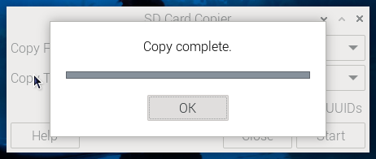

2.1.6 Set the startup sequence, enter the command and press Enter.

```bash
sudo raspi-config
```

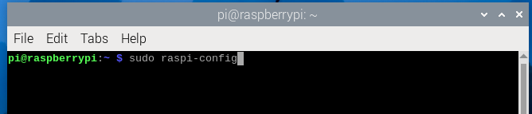

Use 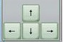 on your keyboard to select **6 Advanced Options** and press Enter to confirm it.

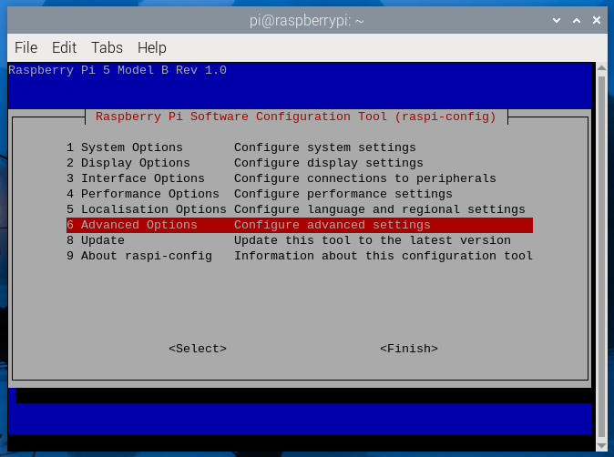 

Select **A4 Boot Order** and press Enter.

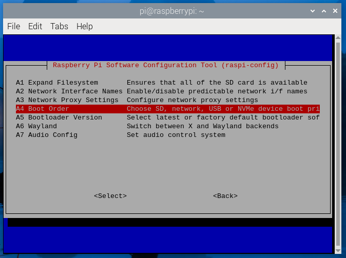

Select **B2 NVMe/USB Boot** and press Enter.

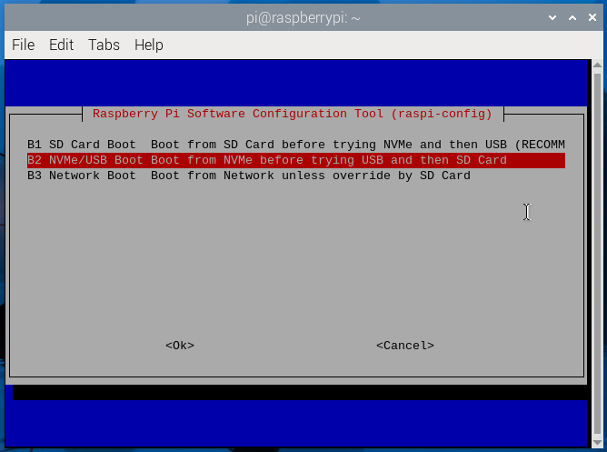

Select **OK** and press Enter，then press the ESC key on the keyboard to exit the settings window.

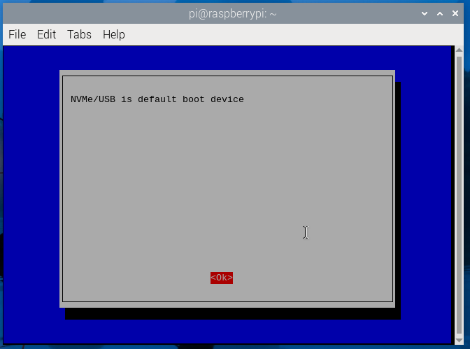

2.1.7 Turn off the power and remove the SD card, then power on the computer.

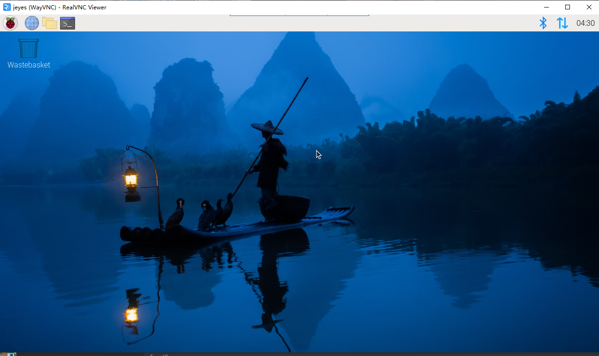
