# **Install Raspberry Pi OS System：**

This tutorial covers how to burn the Raspberry Pi system, how to find the IP address of the Raspberry Pi, and how to perform VNC remote desktop.

## **（一）Hardware and Software：**

### **1.Required Hardware：**

(1) Raspberry Pi 4B/5  (2) TFT memory card above 16G  (3) Card reader  (4) Commonly used computer and accessories

### **2.Operation Method：**

##### （1）Raspberry Pi Imager Software（official software）

**Raspberry Pi Imager Software：**

Download link： [Raspberry Pi Imager](https://www.raspberrypi.com/software/)


After the download is successful, click Install and open it after installation.

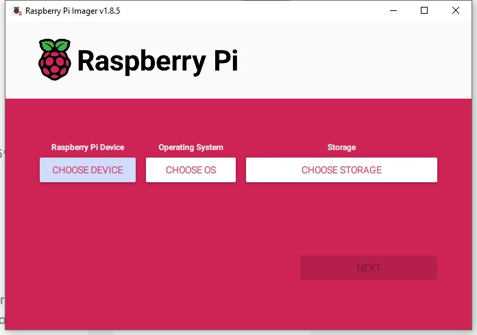

We use Raspberry Pi 5, so select Raspberry Pi 5 in the "Raspberry Pi Device".

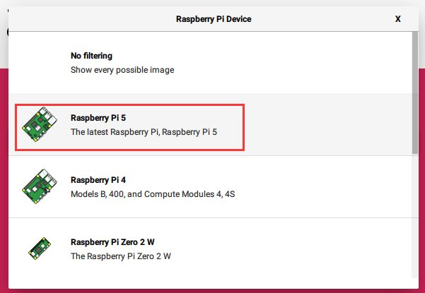

Select "Raspberry Pi OS (64-bit)" in the column below "Operating System" (64-bit or 32-bit is according to the bit of your Raspberry Pi).

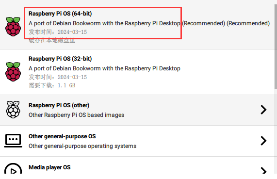

Select the SD card to which we want to burn the Raspberry Pi image system in the column below "Storage".

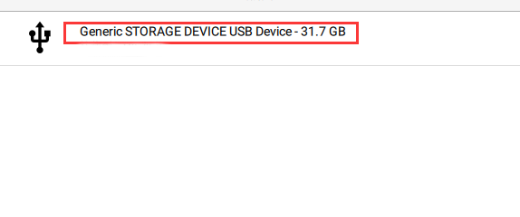

Then click 

Set the Raspberry Pi login name and password, click on `EDITSETTINGS`.

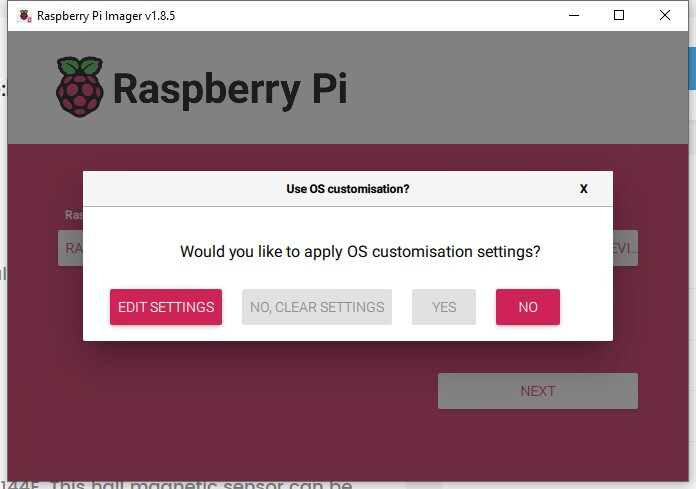

First, check `Set host name`and `Set username and password`, then fill in `Username` as' pi 'and`Password`as' raspberry' (you can also change it to the name and password you want).

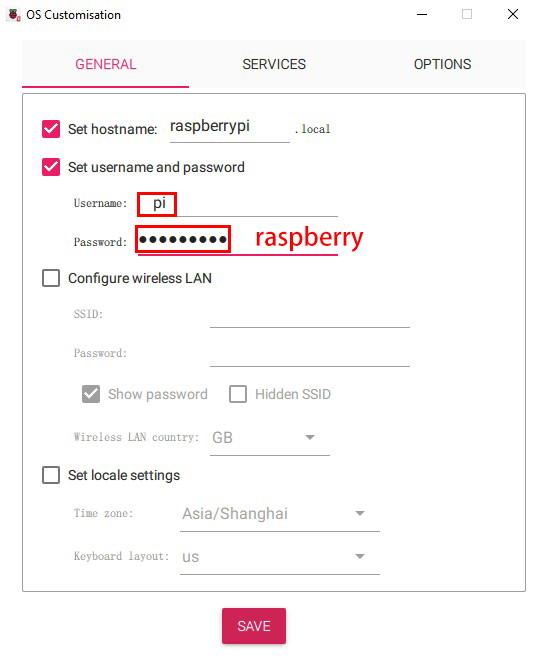

After setting the login name and password, click on `Services` on the right side, then check`Enable SSH `and`Use password authentication`, and finally click on`SAVE `.

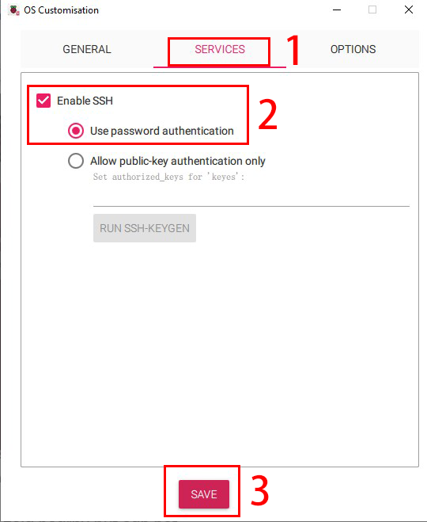


Click`YES`.

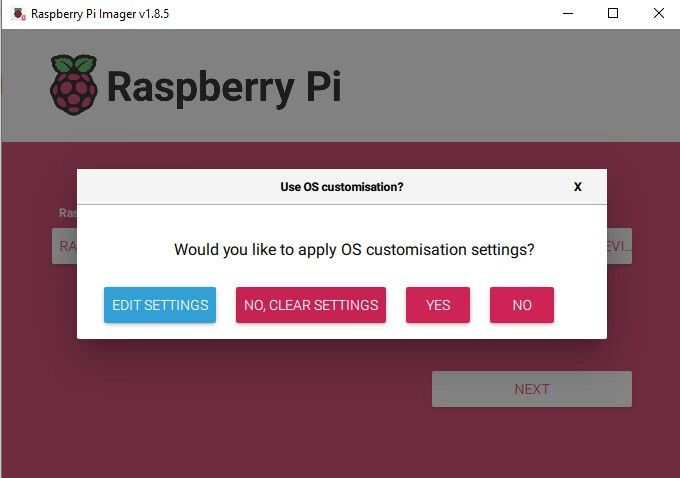

Click `YES` to start burning, be patient and wait until the burning is completed.

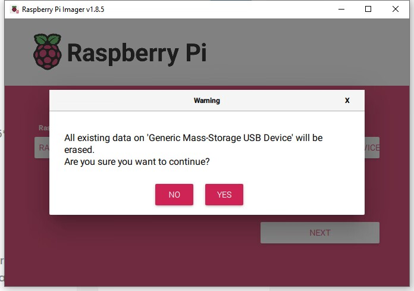

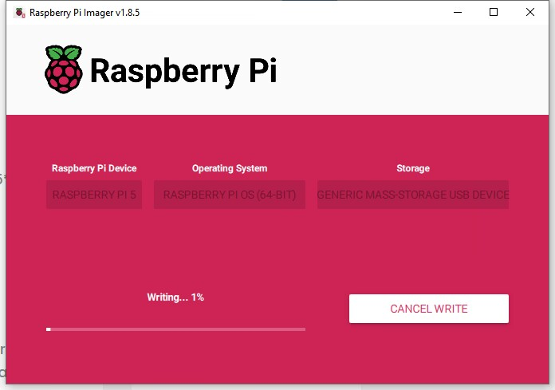

####  （2）Install putty（for SSH remote connection）

Download link：[https://www.chiark.greenend.org.uk/~sgtatham/putty/](https://www.chiark.greenend.org.uk/~sgtatham/putty/)

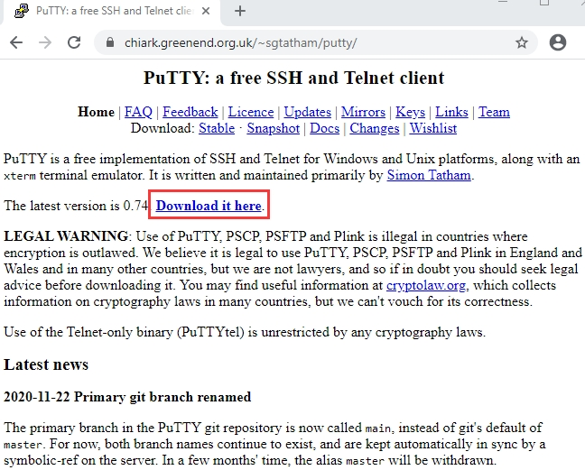 

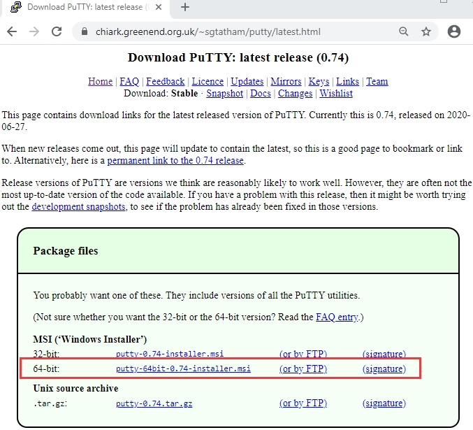

a. After downloading the putty driver file, double-click it and then click "Next".

​    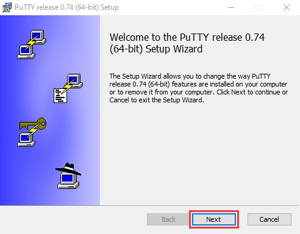

b. Tap “Next”.

  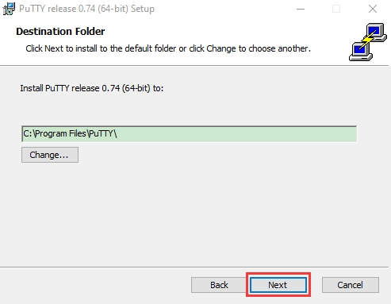

c. Tap “Install Putty files” and “Install”.

  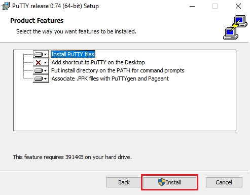

d. Tap “Finish”.

 


##### (3) SSH Remote Login Software WinSCP (can view the Raspberry Pi IP address)

Download link：[https://winscp.net/eng/download.php](https://winscp.net/eng/download.php)

a. After downloading the WinSCP software file, double-click it, then click .

​     

b. Click “Accept”，“Next” and “Install”.

​    

​    

​    

   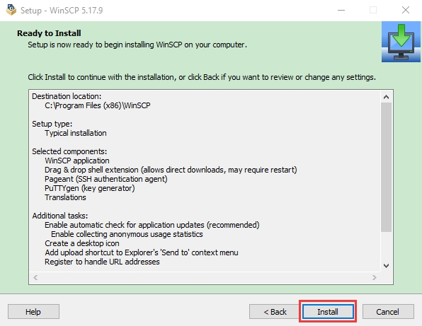

c. After a few seconds, the installation will be completed, click "Finish".

   

Use WinSCP to log in through the default name, default username, and default password of the Raspberry Pi system,These are set when burning the system and need to be consistent with the burning system. (Only one Raspberry Pi can be connected to the same network).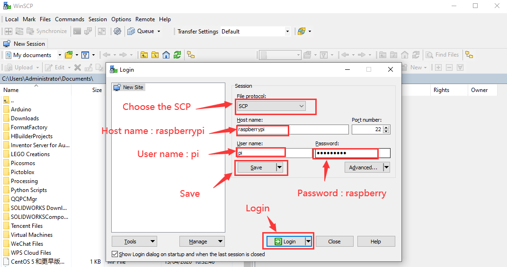

 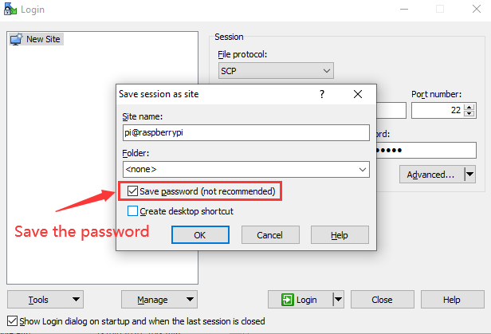

To view the ip address and mac address, click to link and open the PuTTY software, then enter `ip a` to see the ip address. Or click and then enter `ip a` in the command box to see the ip address.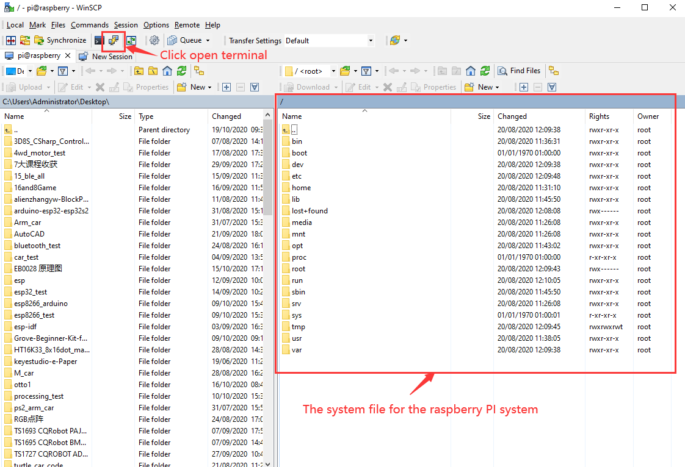

After clicking to open the terminal, you need to enter the password again: raspberry, and then press Enter on the keyboard.


After successful login, open the terminal, enter ***\*ip a\**** and then press Enter on the keyboard to view the ip and mac addresses.

```bash
ip a
```

  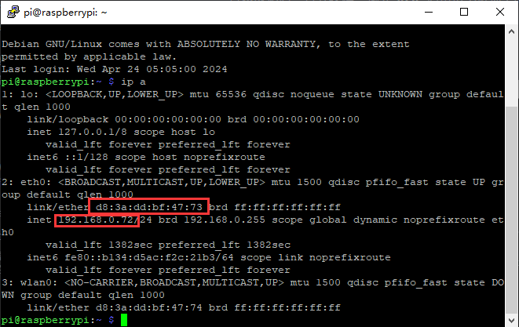

As can be seen from the circle in the picture above, the mac address of my Raspberry Pi is: d8:3a:dd:bf:47:73, and the IP address is: 192.168.0.72(It will be used when we use xrdp to remotely log in to the Raspberry Pi system desktop).

The mac address will not change. If you are not sure which ip address it is, you can use the mac address to confirm it.

##### (4)  Use PuTTY software to remotely connect to the Raspberry Pi, and set the Raspberry Pi to open VNC

1. Use the PuTTY software to open the VNC of the Raspberry Pi, log in with the IP found on the WinSCP software

Enter the IP address in the "Host Name (or IP address)" box and click "OPEN".

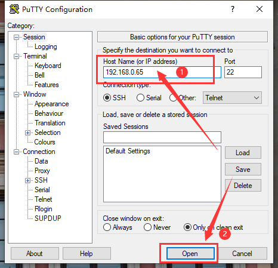

login as：If you don't modify it, the default is "pi".

pi@xxx.xxx.xxx.xxx‘s password：If you don't modify it, the default is “raspberry”.

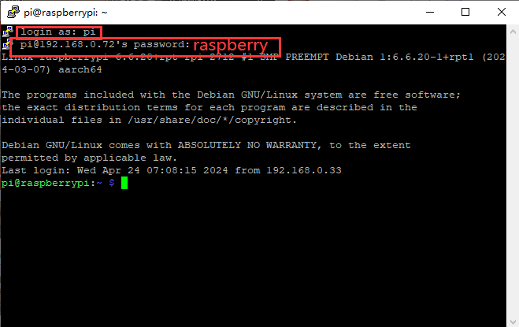

 Then enter `sudo raspi-config` after successful login and press Enter to enter the setting page (if you have opened the PuTTY software through the WinSCP software, there is no need to reopen it).

```bash
sudo raspi-config
```


2.Use of the keyboard to select "3 Interface Options" and press Enter.

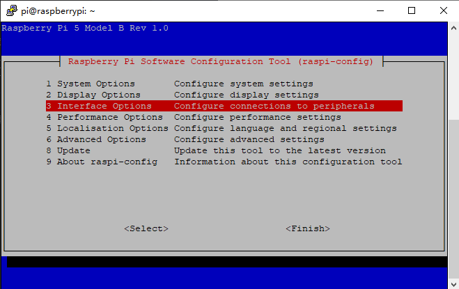

3.Select "I2 VNC" and press the Enter key, then select "YES" and press the Enter key. After the setting is successful, press the "ESC" key on the keyboard to exit it.

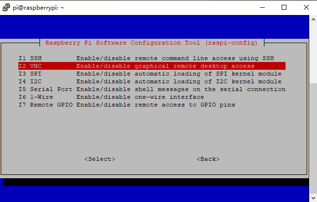

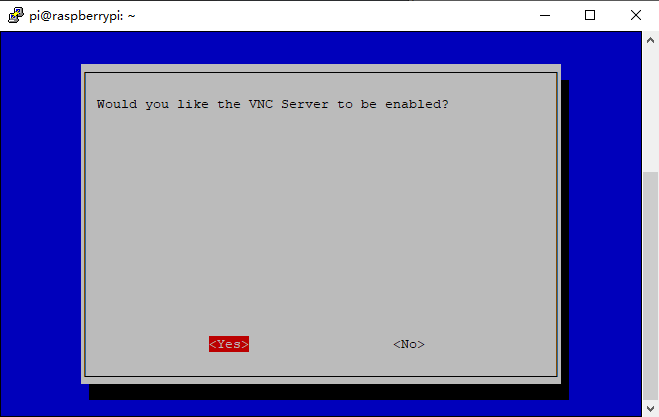

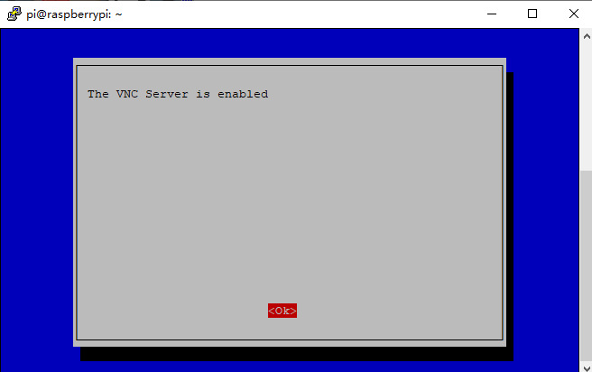

##### （5）VNC viewer（VNC is used to log in to the Raspberry Pi system interface）

Download link：[https://www.realvnc.com/en/connect/download/viewer/](https://www.realvnc.com/en/connect/download/viewer/)

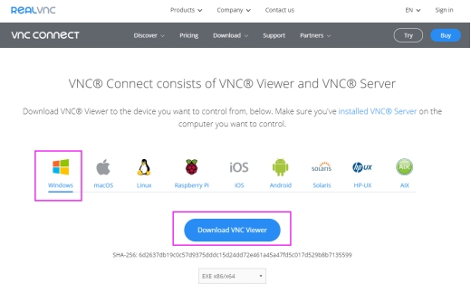

 Then Install it.

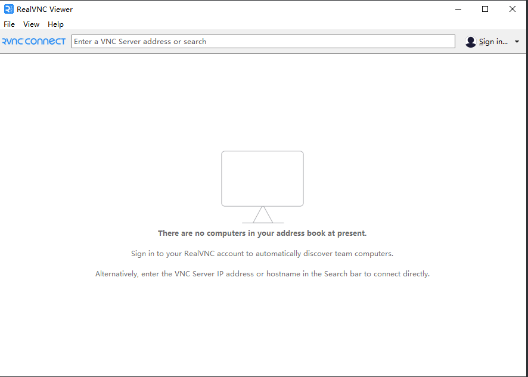

1.Open the VNC viewer software, then click "File" and "New connection...".

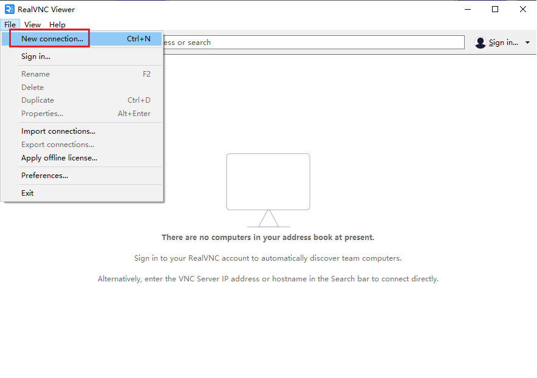

2. Enter the Raspberry Pi's IP address in the VNC Server and click "OK".

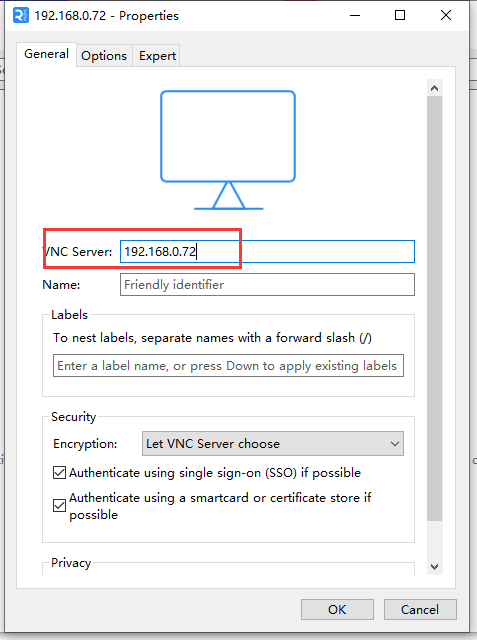

3.Double click on the server named 192.168.0.72.

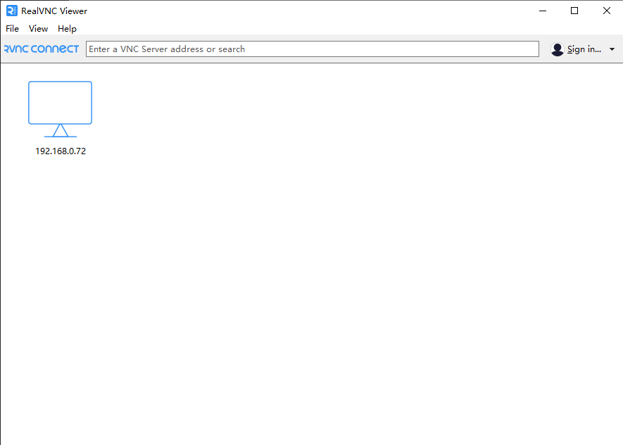

4.Enter pi in the "Username" box, enter raspberry in the password box (note: this is the default if you have not changed the Raspberry Pi login name and password), then check "Remember password" and click OK.

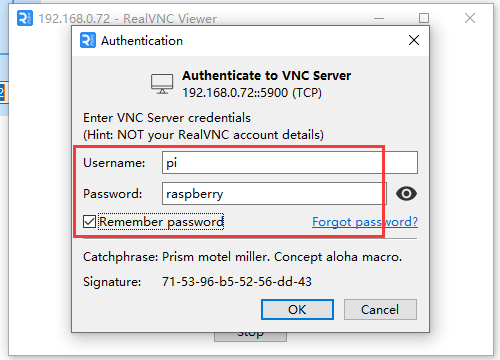

5.Login is successful.

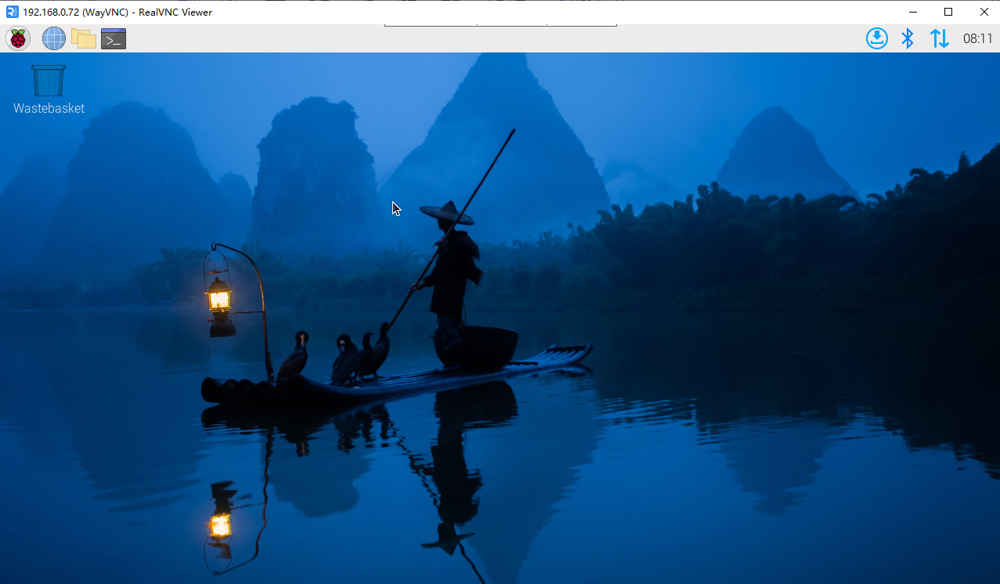

